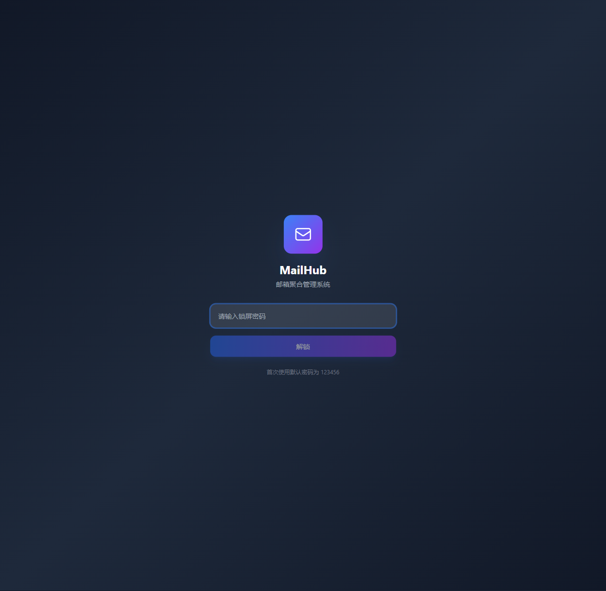
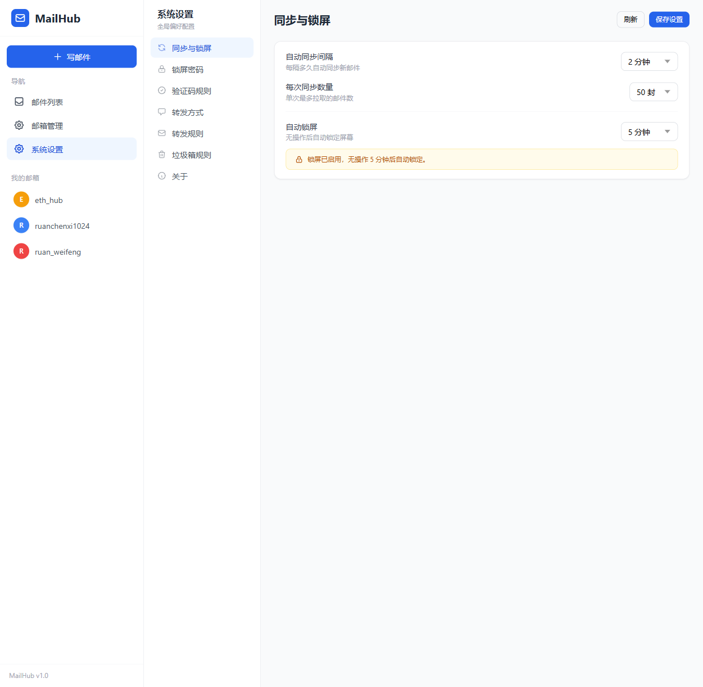

# Mail Hub 📧

邮箱聚合管理系统 — 统一管理多个邮箱账户，支持收件、发件、邮件转发与通知推送。

## ✨ 功能特性

- **多邮箱聚合管理** — 同时管理 163、QQ、Gmail、Outlook 等多个邮箱账户（IMAP/SMTP）
- **邮件收发** — 统一的收件箱视图，支持基础邮件操作
- **邮件搜索** — 按主题、发件人搜索邮件
- **邮件转发与通知** — 自动转发邮件到指定地址，支持 Server 酱、飞书、企业微信等推送通知
- **本地存储** — 邮件数据本地化存储，使用 SQLite 数据库

## 📸 界面预览

| 页面 | 截图 |
|------|------|
| 📧 **登录界面** — 统一的邮件列表视图，支持搜索筛选 |  |
| 📧 **收件箱** — 统一的邮件列表视图，支持搜索筛选 |  |
| 👤 **账户管理** — 多邮箱账户的统一管理与筛选 |  |
| ⚙️ **设置** — 邮件转发、通知推送等全局配置 |  |

## 🛠️ 技术栈

| 层 | 技术 |
|---|---|
| **前端** | React 18 + TypeScript + React Router v6 + Tailwind CSS + Vite |
| **后端** | Express + TypeScript + tsx |
| **数据库** | SQLite (better-sqlite3) |
| **邮件协议** | IMAP (imapflow) + SMTP (nodemailer) + mailparser |

## 📁 项目结构

```
mail-hub/
├── client/                # React 前端
│   └── src/
│       ├── components/    # 通用组件
│       ├── pages/         # 页面组件（收件箱、邮箱管理、设置等）
│       ├── services/      # API 服务层
│       ├── contexts/      # React Context
│       ├── hooks/         # 自定义 Hooks
│       └── types/         # TypeScript 类型定义
├── server/                # Express 后端
│   └── src/
│       ├── routes/        # API 路由
│       ├── services/      # 业务逻辑（邮件收发、转发等）
│       └── types/         # TypeScript 类型定义
└── package.json           # 根项目配置
```

## 🚀 快速开始

### 环境要求

- Node.js >= 18
- npm >= 9

### 安装与运行

```bash
# 克隆仓库
git clone <repo-url>
cd mail-hub

# 安装依赖
npm install
cd client && npm install && cd ..
cd server && npm install && cd ..

# 开发模式运行（前后端同时启动）
npm run dev
```

开发模式下：
- 前端运行在 `http://localhost:5173`
- 后端运行在 `http://localhost:4000`

### Docker 部署（推荐）

项目提供了 Docker 镜像，开箱即用，无需安装 Node.js 环境。

```bash
# 拉取镜像
docker pull ruanzh/mail-hub:latest

# 启动（默认端口 3001）
docker run -d \
  --name mail-hub \
  -p 3001:3001 \
  -v mail-hub-data:/app/server/data \
  ruanzh/mail-hub:latest
```

或者使用 docker-compose：

```bash
# 下载 compose 文件
curl -O https://raw.githubusercontent.com/rzh0001/mail/main/docker-compose.yml

# 启动
docker compose up -d
```

启动后访问 `http://localhost:3001`，默认密码 `123456`。

---

#### 🖥️ 部署到 1Panel

1Panel 是一款流行的 Linux 服务器管理面板，支持通过可视化界面管理 Docker 容器。

**方法一：编排（Compose）部署**

1. 登录 1Panel 管理面板
2. 进入 **容器** → **编排**
3. 点击 **创建编排**
4. 名称填写 `mail-hub`
5. 在编辑框中粘贴以下内容：

```yaml
services:
  mail-hub:
    image: ruanzh/mail-hub:latest
    container_name: mail-hub
    ports:
      - "3001:3001"
    volumes:
      - mail-hub-data:/app/server/data
    environment:
      - NODE_ENV=production
      - PORT=3001
    restart: unless-stopped

volumes:
  mail-hub-data:
```

6. 点击 **确认**，1Panel 会自动拉取镜像并启动容器

**方法二：容器部署**

1. 登录 1Panel 管理面板
2. 进入 **容器** → **容器**
3. 点击 **创建容器**
4. 配置以下参数：

| 参数 | 值 |
|---|---|
| 镜像 | `ruanzh/mail-hub:latest` |
| 容器名称 | `mail-hub` |
| 端口映射 | `3001:3001` |
| 存储卷 | 创建卷 `mail-hub-data`，挂载到 `/app/server/data` |
| 重启策略 | `unless-stopped` |

5. 点击 **确认** 即可

部署完成后通过 `http://你的服务器IP:3001` 访问，默认密码 `123456`。

## ⚖️ 许可协议

本项目使用 **Mail Hub Non-Commercial License** — 仅限非商业用途。

- ✅ **允许**：个人学习、研究、教育、非营利项目使用
- ❌ **禁止**：任何商业用途（企业部署、商业产品销售、付费服务等）
- 📧 **商用授权**：请联系 [替换为实际联系邮箱]

详见 [LICENSE](./LICENSE) 文件。

## 🤝 贡献

欢迎提交 Issue 和 Pull Request。提交前请确保代码通过类型检查：

```bash
cd client && npx tsc --noEmit
cd ../server && npx tsc --noEmit
```
